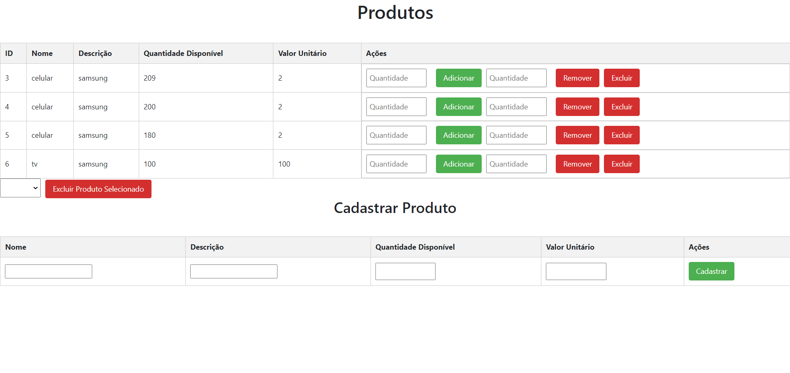

# Frontend do Integrador de Pedidos

Este é o frontend do Integrador de Pedidos, uma aplicação desenvolvida em Angular para gerenciar produtos e pedidos.

## Instalação

Certifique-se de ter o Node.js e o Angular CLI instalados globalmente em sua máquina.

1. Clone este repositório:

```bash
git clone https://github.com/PedroDouglas/front-integrador-pedido.git
```
## Screenshots

